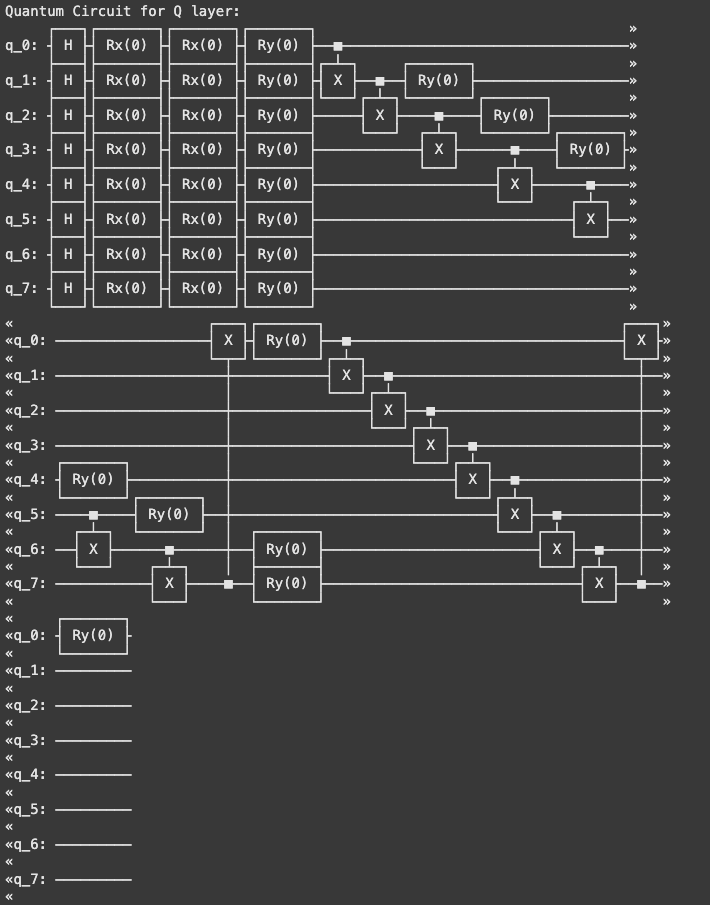

# Hybrid Quantum Vision Transformer (HViT)
## 1. Introduction

### Motivation
The Hybrid Quantum Vision Transformer (HViT) project addresses the need for efficient and accurate models in event classification. Quantum machine learning offers promising solutions to these challenges by leveraging quantum properties like superposition and entanglement to enhance computational efficiency and accuracy. With this project, we hope to improve existing Hybrid Quantum Vision Transformers by making them more accurate and bring them one step closer to existing Classical Vision Transformer models.

### Objectives
The primary goals of this project include:
- Enhancing classical Vision Transformer (ViT) architectures with quantum encoding techniques.
- Exploring the impact of various quantum data encoding methods on model performance.
- Achieving superior event classification accuracy by optimizing hyperparameters and leveraging quantum-enhanced attention mechanisms.
Our hope is to improve HViT to be better than existing Classical Vision Transformer models.

### Quantum Advantage
Quantum machine learning provides unique advantages for this problem by enabling efficient data encoding and representation, reducing the classical model's dependency on large-scale data. Quantum encodings such as phase and amplitude encoding allow for better preservation of data relationships and facilitate more complex pattern recognition tasks. Using quantum circuits in attention mechanism of a transformer model offers several advantages over classical methods.

Quantum circuits can process all possible states of the input data simultaneously due to superposition and Quantum entanglement enables encoding correlations between data features more naturally allowing for Enhanced Representational Power, Efficient Encoding of High-Dimensional Data and Improved Contextual Understanding.

---

## 2. Methods
### Quantum Computing Framework
The project employs Qiskit, a robust open-source quantum computing framework, for designing, simulating, and integrating quantum circuits into the model architecture. Classical components of the transformer model are implemented using PyTorch.
#### Model Architecture
The HViT model is a hybrid quantum-classical architecture inspired by the Vision Transformer (ViT). It incorporates quantum encoders for input feature mapping and classical components for downstream processing. The key components include:

- Quantum Encoding Layer: Encodes classical data into quantum states using various encoding methods.
- Attention Mechanism: Quantum-enhanced Keys, Values, and Queries improve attention map quality by leveraging entanglement and interference.
- Feed-Forward Neural Network: A classical neural network processes encoded and attended features to generate predictions.

#### Quantum Algorithms and Circuits
The project incorporates 3 new quantum encoding techniques, implemented in the circuits.py file:
- **Original Encoding**: Implemented in function (encode_token) Consists of a Hadamard + Rx rotation on the input data and is 1 data point per qubit.
This encoding:
  1. Applies Hadamard to create superposition
  2. Rotates around X-axis based on input data
        
  Example for 2 qubits with data [0.5, 1.0]:
  |0⟩ --H--Rx(0.5)--
  |0⟩ --H--Rx(1.0)--
- **Amplitude Encoding**: New encoding implemented in function (amplitude_encode) Maps data to quantum amplitudes. It consists of 2 data points per qubit. It is good for better preservation of data relationships and more precise control over the quantum state.
This encoding:
  1. Normalizes input data to ensure valid quantum state
  2. Uses Rx and Ry rotations to encode data in amplitudes
        
  Example for 2 qubits with data [0.8, 0.6]:
  Normalized = [0.8/√1.0, 0.6/√1.0]
  |0⟩ --H--Rx(arcsin(0.8))--Ry(arccos(0.8))--
  |0⟩ --H--Rx(arcsin(0.6))--Ry(arccos(0.6))--
- **Phase Encoding**: New encoding implemented in function (phase_encode) Encodes data in quantum phases. It consists of 1 data point per qubit. It is good for pattern recognition tasks and interference-based algorithms. Note that this is the encoding function being run in the current code.
This encoding:
  1. Creates superposition with Hadamard
  2. Applies phase rotation based on data
        
  Example for 2 qubits with data [0.5, 1.0]:
  |0⟩ --H--Rz(0.5)--
  |0⟩ --H--Rz(1.0)--
- **Dense Angle Encoding**: New encoding implemented in function (dense_angle_encode), whcih uses all three rotation angles. It consists of 3 data points per qubit. It is good for maximum data density, more efficient use of resources, and better for complex data patterns. 
This encoding:
  1. Applies all three rotation gates (Rx, Ry, Rz)
  2. Enables encoding 3 data points per qubit
        
  Example for 1 qubit with data [0.5, 1.0, 0.7]:
  |0⟩ --Rx(0.5)--Ry(1.0)--Rz(0.7)--

#### Hyperparameters
The hyperparameters of the HViT model were adjusted to optimize its performance and computational efficiency. The key differences are detailed below:
1. Number of Transformer Layers (n_layers) : 2
Impact: The transformer has fewer layers, reducing the model's depth. This simplifies the architecture and decreases computational requirements. A smaller number of layers can mitigate overfitting on smaller datasets while potentially speeding up training. However, this may reduce the model's capacity to learn highly complex patterns if the data requires deeper processing.
2. Fully Connected (FC) Layers (FC_layers): [64, 32]
Impact: The new neural network layers introduces two layers with 64 and 32 neurons, respectively, significantly increasing the representational power and enabling the classifier to better map learned features to the target space. This change likely improves the model's downstream performance, especially for more complex tasks like multi-class classification.
3. Attention Head Dimension (head_dimension): 4
Impact: This parameter controls the size of each attention head in the multi-head attention mechanism. Reducing the head dimension halves the size of the subspace for each attention head. While smaller heads reduce computational cost, they might also slightly reduce the granularity of feature extraction. This adjustment strikes a balance between performance and efficiency, ensuring the model can scale to larger datasets or more complex tasks without excessive computational overhead.
4. Embedding Dimension (Embed_Dim): 32
Impact: This parameter remains constant, maintaining the size of the token embeddings. The embedding size is critical for capturing sufficient information from each token without excessively increasing computational cost.
5. Feed-Forward Dimension (ff_dim): 64
Impact: The feed-forward network within each transformer layer retains its hidden layer size. This parameter ensures that the transformer's capacity to learn intermediate representations remains unchanged.
6. Classifying Type (classifying_type): 'max'
Impact: The aggregation method for token outputs remains unchanged. Max pooling continues to focus on the most prominent features across tokens for classification. From our tests this seems to be the best pooling method.
7. Positional Embedding (pos_embedding): True
Impact: Positional encoding remains enabled, allowing the transformer to account for spatial relationships among patches.

#### Quantum Circuits
In this code we introduce a 8 qbit quantum circuit used to calculate the Key, Value and Query for each attention head. This is the basics of a hybrid transformer model and instead of doing matrix multiplication we are able to speed up this process via Superposition and Parallelism. Here are the quantum circuits that we used to calucalte the Key, Value and Query of our attention mechanism:

Key circuit:

Value circuit:

Query circuit:

This circuit produces the key, value, and query vectors for an attention head by encoding the input data into a highly entangled quantum state through sequential rotation and entanglement gates, which capture complex relationships between input features. The parameterized rotation gates allow for tunable embeddings, while the controlled-X gates introduce correlations essential for generating the contextual dependencies required by attention mechanisms. Here are the gates used and explained:
1. Initialization with Hadamard Gates (H):
Purpose: Applies to all qubits to put them into an equal superposition of ∣0⟩ and ∣1⟩.
Reason: Ensures all computational states are accessible, preparing for interference and entanglement.

3. Sequential Rx Gates:
Purpose: Adds parameterized rotations about the X-axis. These gates allow fine-tuning of the quantum state.
Reason: Multiple Rx gates in a row provide flexibility to model complex quantum states.
Order: Immediately after superposition to build the desired variational state.

5. Ry Gates:
Purpose: Adds parameterized rotations about the Y-axis to complement the Rx gates.
Reason: Together, Rx and Ry gates span the Bloch sphere, enabling the circuit to encode any quantum state.
Order: After Rx gates, to ensure full expressiveness of the variational circuit.

7. Controlled-X Gates (CX or CNOT):
Purpose: Creates entanglement between qubits, crucial for quantum correlations and capturing dependencies between data points.
Reason: Introduces non-local operations that classical systems cannot easily replicate.
Order: Positioned between rotation layers to alternate between local (rotations) and global (entanglement) operations, increasing expressiveness.

9. Second Layer of Ry Gates:
Purpose: Introduces additional tunable parameters to refine the quantum state after entanglement.
Reason: Ensures sufficient parameterization after introducing correlations through entanglement.
Order: After the first entanglement layer, allowing the circuit to adjust the correlated quantum states.

10. Final Layer of Controlled-X Gates (CX):
Purpose: Strengthens the entanglement across the system.
Reason: A second entanglement layer helps capture deeper correlations and interdependencies.
Order: Positioned after additional parameterization to optimize the resulting entangled state.

11. Optional Final Rotations (Ry):
Purpose: Refines the state preparation further before measurement.
Reason: Allows additional tunability after all entanglements are introduced.
Order: As the final step, these gates act as a fine-tuning mechanism.

---

## 3. Dataset and Preprocessing
#### Data Description
The dataset is the MNIST handwritten digits comprises of Hand written digits used for classification tasks. The input features are encoded and the labels correspond to event categories.

#### Preprocessing Steps

Data normalization to ensure compatibility with quantum encoding.
Feature scaling to match the range required for Rx, Ry, and Rz rotations.
Dimensionality reduction for dense encoding techniques.
#### Data Visualization
Preprocessing techniques were validated through feature histograms and scatter plots to confirm appropriate scaling and normalization.

### NOTE:
this dataset already has been preprocessed. We are using data already preprocessed for us so you will not find preprocessing steps inside this notebook itself.

---

## 4. Results
All experiments were conducted using quantum simulations on classical hardware.

#### Key Findings

##### 1. Impact of Encoding Techniques:
Dense angle encoding yielded the best performance for complex data patterns.
Phase encoding demonstrated efficiency in pattern recognition tasks.
##### 2. Hyperparameter Tuning:
Adding more layers and neurons in the feed-forward network significantly improved accuracy.
Increasing qubits for Keys, Values, and Queries in the attention layer enhanced the model's ability to encode spatial and semantic information, improving overall performance.
Here are the specific hyperparameters we used for our results:
transformer_dims = {
    'Token_Dim': data_patched.shape[-2],
    'Image_Dim': data_patched.shape[-1]
}

transformer_hyper = {
    'n_layers': 2,
    'FC_layers': [64, 32],
    'head_dimension': 4,
    'Embed_Dim': 32,
    'ff_dim': 64
}

transformer_type = {
    'classifying_type': 'max',
    'pos_embedding': True
}

##### Performance Metrics

- Accuracy: Increased with optimized quantum encoding and hyperparameters.
Resulted around a 93% accuracy for our training set (tr_accuracy) and around a 87% accuracy for our validation set (val_accuracy)
  

- Loss: Reduced significantly with denser neural networks.
Resulted around a 0.3 loss for our training set (tr_accuracy) and around a 0.5 loss for our validation set (val_accuracy)

This is a significant improvement to already existing HViT models but there still needs to be more research done to make it better than classical models.

## 5. Conclusion
#### Summary
The HViT project demonstrated the potential of integrating quantum machine learning with classical transformers for event classification. Quantum encodings and hybrid architectures improved model accuracy and efficiency.

#### Impact
This work highlights the feasibility of hybrid quantum-classical models in solving complex classification tasks, paving the way for future applications in high-energy physics and beyond.

#### Future Work

Evaluate the model on actual quantum processing units (QPUs) to test scalability.
Investigate additional quantum encoding schemes for diverse datasets.
Extend the approach to other domains requiring efficient data representation.
## 6. References
- "Hybrid Quantum Vision Transformers for Event Classification in High Energy Physics" [arXiv:2402.00776](https://arxiv.org/abs/2402.00776).
- "Quantum Data Encoding: A Comparative Analysis of Classical-to-Quantum Mapping Techniques and Their Impact on Machine Learning Accuracy" [arXiv:2311.10375](https://arxiv.org/pdf/2311.10375).
